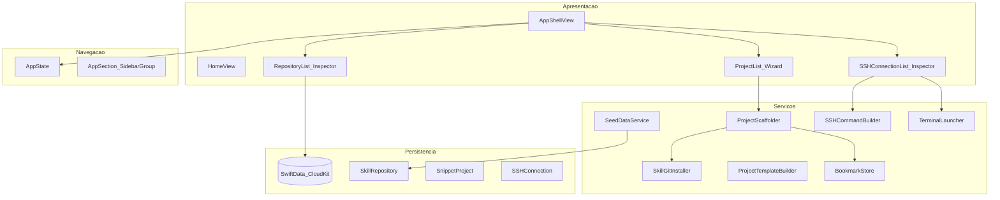

# Arquitetura

## Propósito

**MLTerminalSnippets** é um app macOS nativo para:

1. Gerenciar **repositórios Git de Agent Skills** (cadastro, edição, sync iCloud).
2. **Gerar projetos** com contexto, skills selecionados e scaffold para **Cursor** (`AGENTS.md`, `.cursor/skills/`, etc.).
3. Cadastrar **acessos SSH** e abrir o comando no **Terminal.app**.

## Stack

| Camada | Tecnologia |
|--------|------------|
| UI | SwiftUI 6, `NavigationSplitView` (3 colunas) |
| Estado de navegação | `@Observable` `AppState` |
| Persistência | SwiftData + `cloudKitDatabase: .automatic` |
| Concorrência | Swift 6, `@MainActor` na UI e serviços AppKit |
| Sandbox | App Sandbox, arquivos do usuário, rede, Apple Events |
| Integrações | Git (sparse clone), Terminal.app (AppleScript), Finder, Cursor |

**Deployment:** macOS 15.7+ · Bundle `me.micheltlutz.MLTerminalSnippets`

## Diagrama de camadas



## Modelos SwiftData

| Modelo | Descrição | Relações |
|--------|-----------|----------|
| `SkillRepository` | Repo Git + pasta do skill (`swiftui-pro`, etc.) | ↔ `SnippetProject.selectedSkills` |
| `SnippetProject` | Histórico de projeto gerado + bookmark da pasta | → skills |
| `SSHConnection` | Host, usuário, porta, modo auth, `.pem`, comando custom | — |

Regras CloudKit: propriedades com **valor padrão**, sem `@Attribute(.unique)`. Ver [ADR 0003](adr/0003-swiftdata-cloudkit-persistence.md).

## Estrutura de pastas (target)

```
MLTerminalSnippets/
├── App/                    # @main, ModelContainer
├── Models/                 # @Model, enums de domínio
├── Navigation/             # AppSection, AppState
├── Services/               # Lógica de negócio e I/O
├── ViewModels/             # Drafts e validadores
├── Views/
│   ├── Shell/              # Sidebar, AppShell
│   ├── Home/
│   ├── Repositories/
│   ├── Projects/
│   ├── SSH/
│   ├── Settings/
│   └── Components/         # SearchField, SkillChip, etc.
└── MLTerminalSnippets.entitlements
```

## Fluxos principais

### Seed de repositórios built-in

Na primeira execução, `SeedDataService` insere 5 skills (SwiftUI Pro, SwiftData Pro, Concurrency, Testing, Architecture). Flag em `UserDefaults`.

### Novo projeto (wizard)

1. Usuário preenche 5 etapas (identidade → contexto → skills → destino → revisão).
2. `ProjectScaffolder` cria pasta, README, AGENTS.md, `.gitignore`.
3. Opcional: `SkillGitInstaller` (sparse clone) → `.cursor/skills/{slug}/`.
4. Opcional: `git init`.
5. Persiste `SnippetProject` com bookmark da pasta.

### Acesso SSH → Terminal

1. Modo **padrão**: `SSHCommandBuilder` monta `ssh -i key -p port user@host`.
2. Modo **personalizado**: comando verbatim (templates: ssh-copy-id, add user).
3. `TerminalLauncher` via `osascript` / `NSAppleScript`; fallback: abre Terminal + copia comando.

## Extensibilidade planejada

Sidebar reserva itens desabilitados: **Templates**, **Catálogo**, **Snippets**. Novas features = novo `AppSection` + pasta em `Views/` sem reescrever o shell (ver [ADR 0005](adr/0005-three-column-navigation-shell.md)).

## Testes

| Arquivo | Escopo |
|---------|--------|
| `ProjectTemplateBuilderTests` | README, AGENTS, file tree |
| `SSHCommandBuilderTests` | Montagem de comando SSH |

Testes de UI não fazem parte do MVP.
